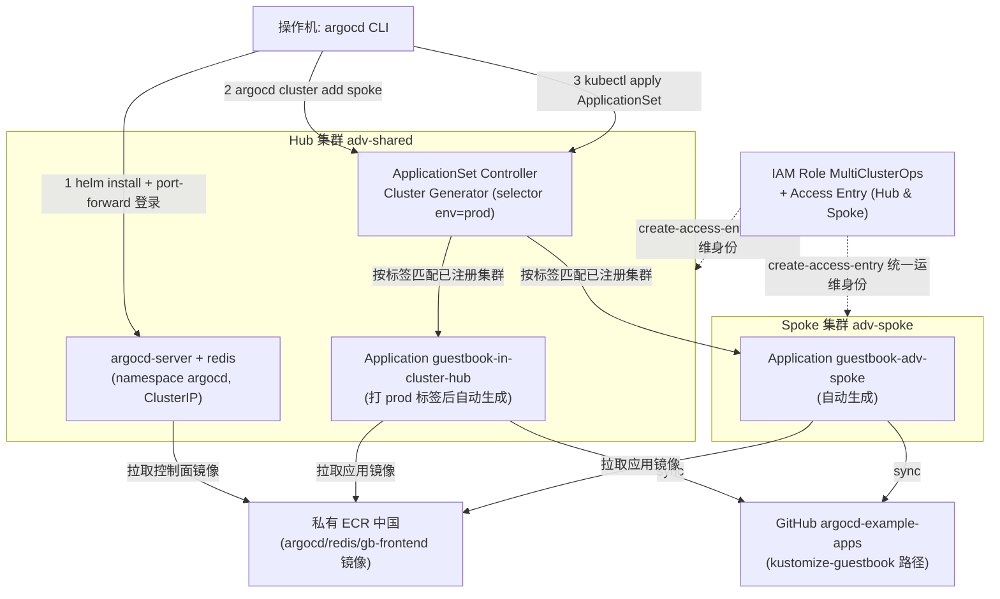
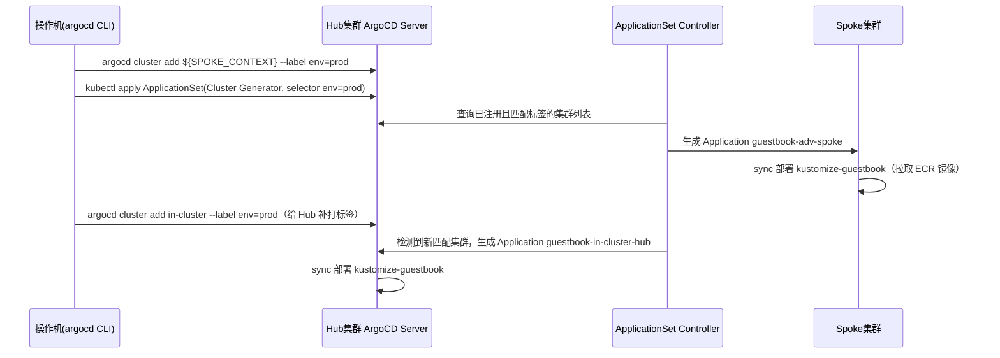
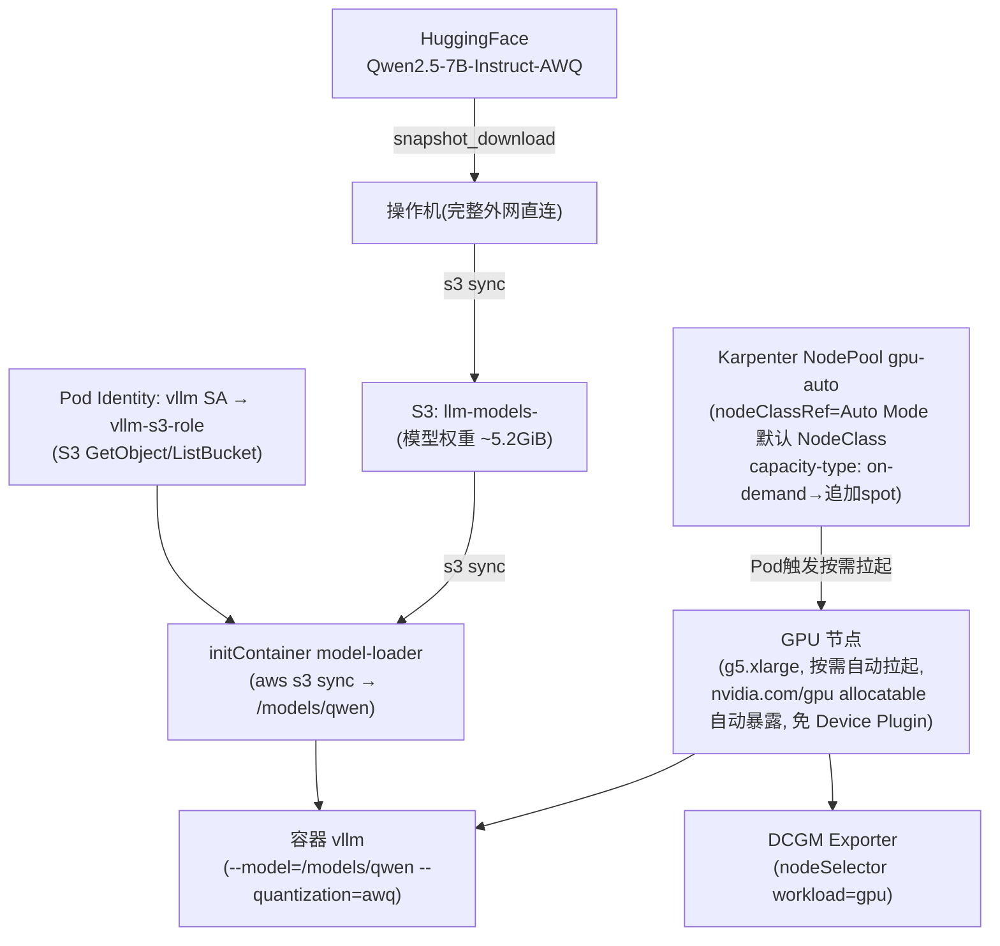
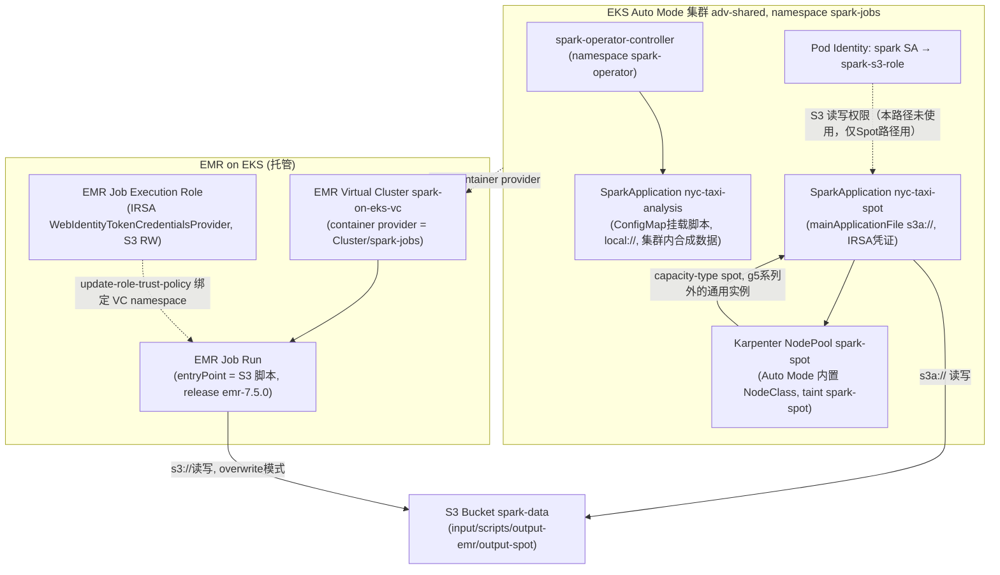
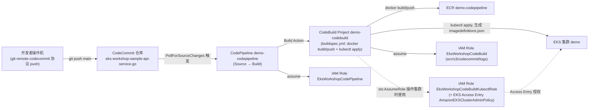
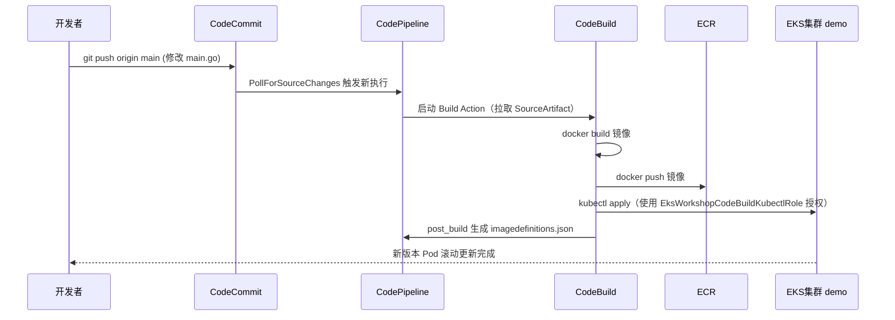
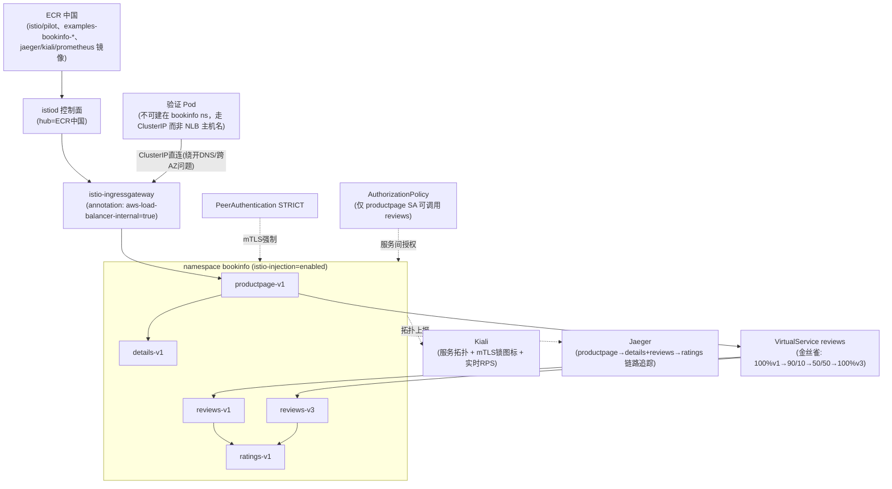

# 架构文档

本仓库包含 12 个 Lab（`docs/lab01-*.md` ~ `docs/lab12-*.md`），这里不做全量架构图汇总，只对其中组件交互较复杂、值得可视化的 Lab 提供架构图；其余 Lab 请直接看对应的 `docs/labNN-*.md`。

选中的 5 个 Lab：

- **Lab02** — 多集群管理（ArgoCD Hub-Spoke）：跨 2 个 EKS 集群的 GitOps 分发，涉及 Hub/Spoke 集群、ApplicationSet 控制器、跨集群 IAM 身份
- **Lab05** — GenAI GPU 推理（vLLM）：Auto Mode 内置 Karpenter 原生支持 GPU/GPU Spot（免 Device Plugin），配合 Pod Identity 从 S3 加载真实模型
- **Lab06** — Spark on EKS：Spark Operator（开源）与 EMR on EKS（托管）两条数据处理路径并行，外加 Karpenter Spot 混合调度
- **Lab08** — CodePipeline 进行 EKS CI/CD：CodeCommit → CodePipeline → CodeBuild → ECR → EKS 的跨 AWS 服务交付链路
- **Lab12** — Istio 服务网格：中国区私有镜像仓库部署 + 内部 NLB/ClusterIP 验证 + Kiali/Jaeger 可观测性的完整闭环

其余 Lab（Lab01 Auto Mode、Lab03 Kubecost、Lab07 Gateway API+LBC、Lab09 OpenSearch+Fluent Bit、Lab10 集群升级、Lab11 Kyverno）以单一组件/单一操作链路为主，不再单独画图。

---

## Lab02 — 多集群管理（ArgoCD Hub-Spoke）

Hub 集群 `adv-shared` 部署 ArgoCD Server；Spoke 集群 `adv-spoke` 作为部署目标注册进 ArgoCD。ApplicationSet 用 Cluster Generator 按 `env=prod` 标签自动为每个已注册集群生成 Application，实现"一份 Git 仓库，自动同步到所有打标集群"；同时给 Hub 集群补打 `env=prod` 标签后，ApplicationSet 会自动再为 Hub 生成一个 Application，验证自动分发机制。中国区所有镜像（ArgoCD、Redis、guestbook 应用镜像）都需先转存到私有 ECR，示例应用改用 `kustomize-guestbook` 路径以支持镜像覆盖。

集群注册与自动分发的时序（ApplicationSet 如何在打标后自动补建 Application）：

## Lab05 — GenAI GPU 推理（vLLM）

与 Managed NodeGroup + 手动 Device Plugin 的传统方式不同，本 Lab 确认 **EKS Auto Mode 内置 Karpenter 原生支持 GPU 与 GPU Spot**：只需一个引用 Auto Mode 默认 NodeClass 的 `NodePool`，Pod 提交后即可按需拉起 GPU 节点，全程不需要安装 NVIDIA Device Plugin；NodePool 加上 `spot` capacity-type 即可择机拉起 Spot GPU 节点。真实的 Qwen2.5-7B-AWQ 模型从操作机下载后上传 S3，vLLM Pod 通过 initContainer 用 Pod Identity 凭证从 S3 同步模型再启动推理。

---

## Lab06 — Spark on EKS

对比开源自建（Spark Operator）与 AWS 托管（EMR on EKS）两条数据处理路径，并演示 Driver 常驻节点 + Executor Spot 的成本优化。Spark Operator 路径受限于官方 `spark-py` 镜像缺 `hadoop-aws`，改用 ConfigMap 挂载脚本 + 集群内合成数据（`local://`），不走 S3；EMR on EKS 路径走 IRSA 凭证，完整验证真实 S3 读写；第三条路径把 Executor 调度到 Auto Mode 内置 NodePool 创建的 Spot 节点上，Driver 仍在普通节点。

## Lab08 — CodePipeline 进行 EKS CI/CD

基于中国区原生服务（CodeCommit + CodeBuild + CodePipeline + ECR）构建 CI/CD 闭环：开发者推送代码触发 CodePipeline，CodeBuild 用 `buildspec.yml` 构建镜像并推送 ECR，再用绑定了 EKS Access Entry 的独立 IAM Role 对集群执行 `kubectl apply` 完成部署。CodeBuild 自身的服务角色（拉代码/推镜像/写日志）与它用来操作 EKS 的角色是两个独立 Role，职责分离。

推送代码到自动部署完成的时序：

---

## Lab12 — Istio 服务网格

可选 Lab（面向微服务数量 ≥ 50 的中大型客户场景）。中国区镜像全部转存到 ECR；Ingress Gateway 强制改为 `internal` NLB。两个关键点决定了验证方式：① 验证用的临时 Pod 不能建在开了 `istio-injection=enabled` 的命名空间，否则自己也被注入 sidecar；② 集群内验证一律改用 Ingress Gateway 的 ClusterIP（绕开 DNS 解析和跨可用区负载均衡问题）。金丝雀发布路径为 100%v1 → 90/10 → 50/50 → 100%v3，比 Global 版本多一级过渡。可观测性额外部署 Kiali 与 Jaeger。

